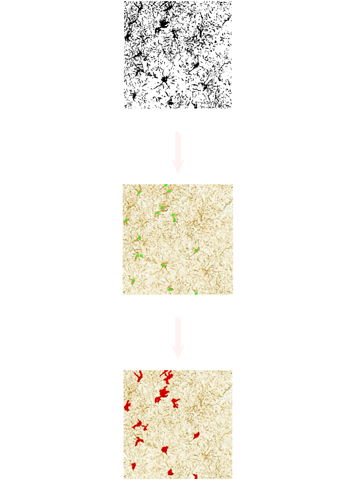

# Astrocyte-detection

Astrocytes play a crucial role in maintaining brain homeostasis and are implicated in various neurological disorders. This software enables researchers and clinicians to automatically detect astrocytes from microscopy images, improving the speed and accuracy of analysis in neurobiological studies.


## Overview

This repository provides a full pipeline for astrocyte segmentation from stained brain scan tiles using a self-supervised SimCLR-based encoder and a modified U-Net with a ResNet-18 backbone. SimCLR was chosen to address the scarcity of annotated data at the time, enabling the model to learn meaningful features from over 100,000 unlabeled 512×512 tiles. The encoder was then fine-tuned on only 200 semi-automatically segmented tiles generated via a rule-based pipeline included in this repo.


## Features
- Self-supervised SimCLR encoder trained on large unlabeled dataset of brain tiles

- Modified U-Net using the pretrained encoder with a ResNet-18 backbone

- Semi-automated annotation tool for generating segmentation masks

- Pretrained weights and configs included for reproducibility

- Easy retraining support with custom data for both encoder and U-Net


## Run Locally

Clone the project

```bash
  git clone https://github.com/raisaaajose/astrocyte-detection.git

```

Go to the project directory

```bash
  cd astrocyte-detection
```

Install dependencies

```bash
  pip install -r requirements.txt

```

Run pretrained U-Net on test images

```bash
  python unet/predict.py --input_dir path/to/images --weights      pretrained/unet.pth

```

## Datasets

**Unlabeled**: 100,000+ 512×512 brain tile images for SimCLR generously provided by the [Sudha Gopalakrishnan Brain Centre (SGBC)](https://iitm.humanbrain.in/index.html), [IIT Madras](https://www.iitm.ac.in/), as part of their ongoing research in astrocyte morphology.

**Labeled**: 200 tiles with segmentation masks created semi-automatically using the rule-based labeling pipeline

## Labeled Masks
To avoid the overkill of manual annotations, A simple rule-based pipeline was used to generate rough segmentation masks that can still be tweaked manually if needed. It applies a series of median blurring and erosion operations on the binary mask to identify potential cell centroids. These centroids are then used to flood-fill the same mask, producing more complete semantic segmentations. This approach gave us around 200 semi-automated masks, which were good enough to fine-tune the model effectively.

<p align="center">
  
</p>
## Suggestions for Users
Start by using the pretrained models to evaluate performance on your dataset.

For domain adaptation, retrain the SimCLR encoder using your own unlabeled brain tiles.

Use the semi-automated rule-based tool to quickly generate initial masks for small datasets.

## TODO / Future Work
Add support for larger tile sizes

Add support for Docker

Improve mask refinement in the rule-based pipeline

Integrate interactive annotation support

Integrate CLI flags for directory paths


## Acknowledgements

 - [A Simple Framework for Contrastive Learning of Visual Representations (SimCLR)](https://research.google/pubs/a-simple-framework-for-contrastive-learning-of-visual-representations/)
 - [SimCLR Implementation in PyTorch by Spijkervet](https://github.com/Spijkervet/SimCLR)
 - [Sudha Gopalakrishnan Brain Centre (SGBC)](https://iitm.humanbrain.in/index.html), [IIT Madras](https://www.iitm.ac.in/)
 - [Classification of Microglial Morphological Phenotypes Using Machine Learning](https://www.frontiersin.org/journals/cellular-neuroscience/articles/10.3389/fncel.2021.701673/full)

